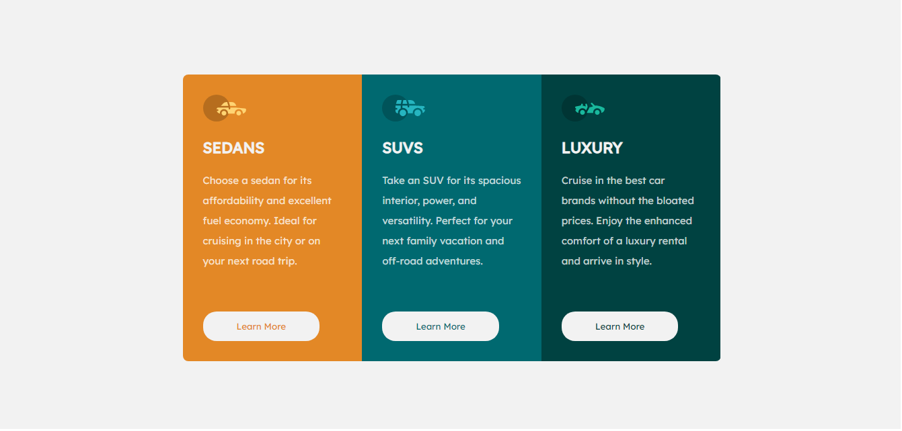

# Frontend Mentor - 3-column preview card component solution

This is a solution to the [3-column preview card component challenge on Frontend Mentor](https://www.frontendmentor.io/challenges/3column-preview-card-component-pH92eAR2-). Frontend Mentor challenges help you improve your coding skills by building realistic projects. 

## Table of contents

- [Overview](#overview)
  - [The challenge](#the-challenge)
  - [Screenshot](#screenshot)
  - [Links](#links)
- [My process](#my-process)
  - [Built with](#built-with)
  - [What I learned](#what-i-learned)
  - [Continued development](#continued-development)
  - [Useful resources](#useful-resources)
- [Author](#author)

## Overview

Hi everyone, I made this project to practice CSS.

### The challenge

Users should be able to:

- View the optimal layout depending on their device's screen size
- See hover states for interactive elements

### Screenshot

### Links

- Solution URL: [3-column](https://3-column.netlify.app/)

## My process

### Built with

- Semantic HTML5 markup
- CSS custom properties
- Flexbox
- CSS Grid
- Mobile-first workflow

### What I learned

I learned how to position different divs in rows and columns.

### Continued development

I want to continue improving my knowledge in Flexbox and learn more about CSS Grid, I plan to develop this project using CSS Grid

### Useful resources

- [CSS-tricks](https://css-tricks.com/snippets/css/a-guide-to-flexbox/) - This helped me for Flexbox and CSS Grid. 

## Author

- Website - [Erick Cerna](https://erick-cerna.netlify.app/)
- Frontend Mentor - [@erickcerna](https://www.frontendmentor.io/profile/erickcerna)
- Twitter - [@tavo_rasta](https://www.twitter.com/tavo_rasta)

